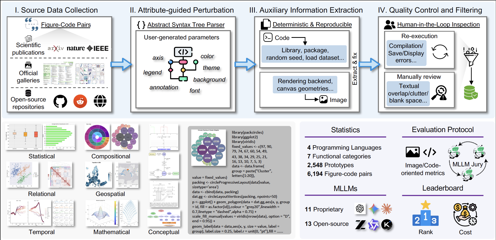
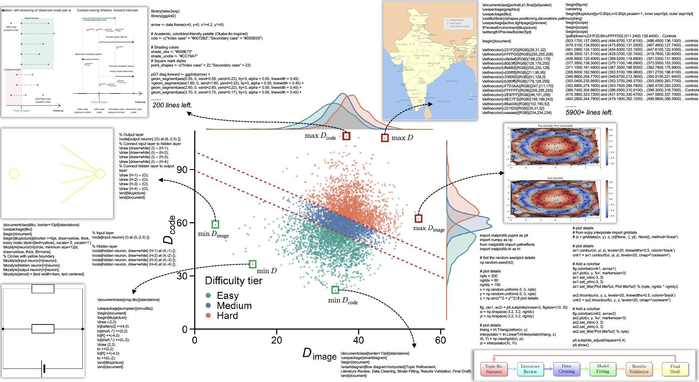
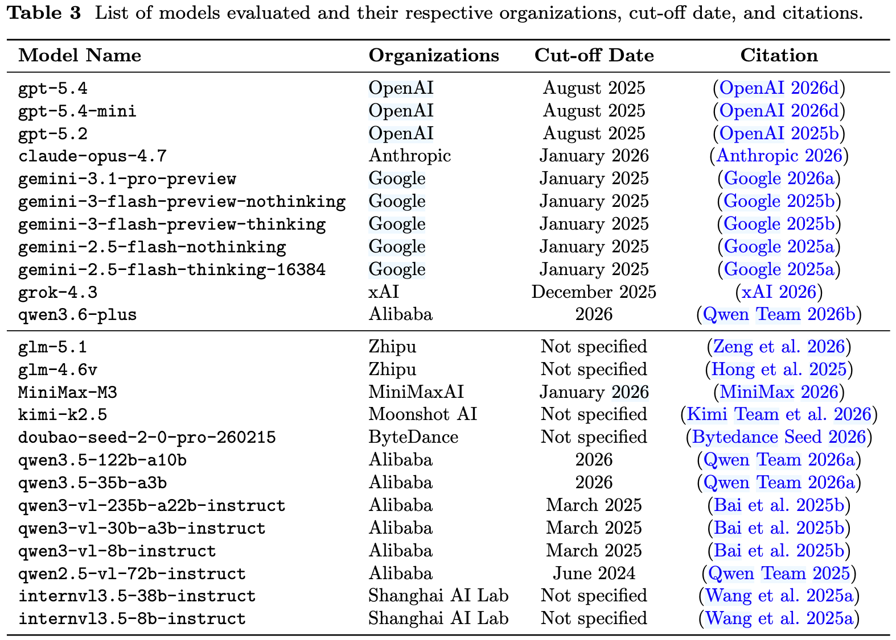
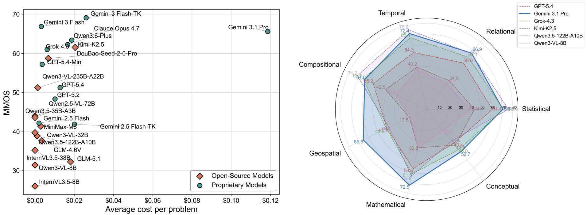
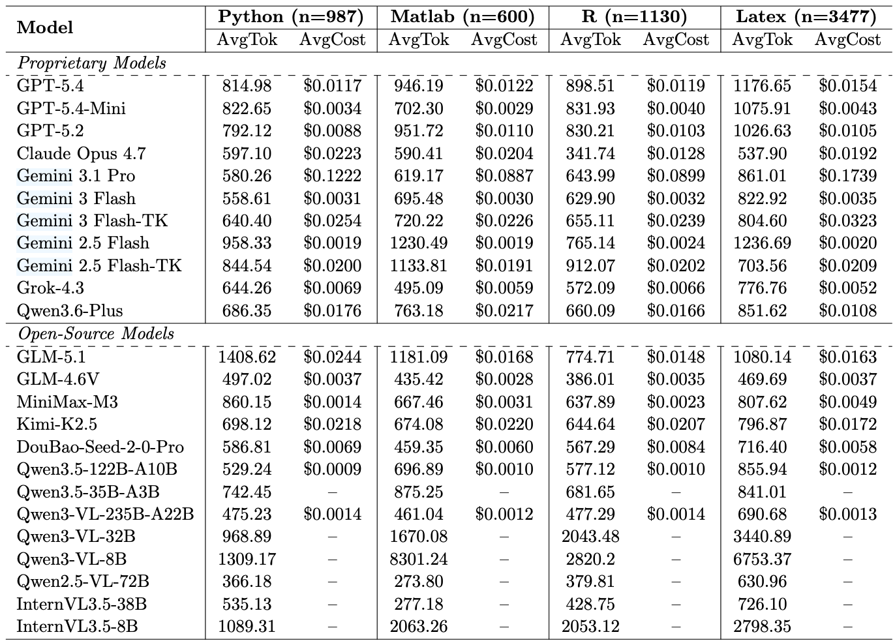
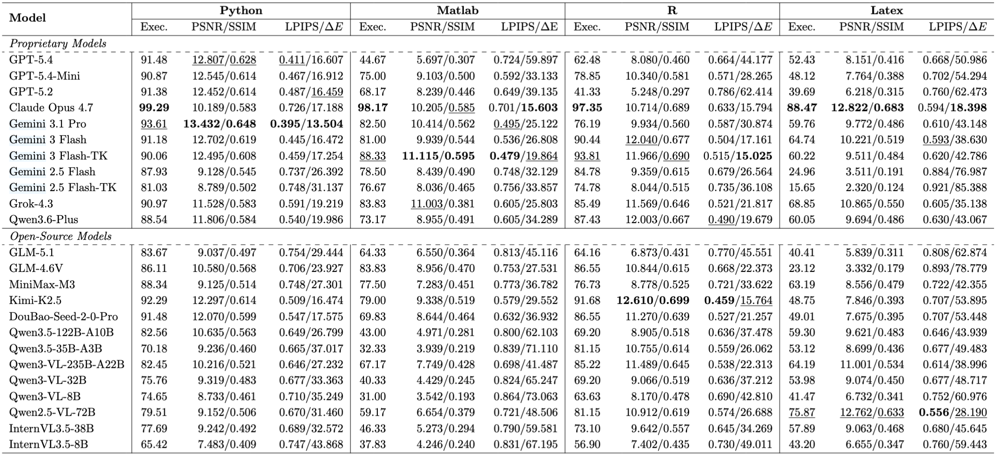
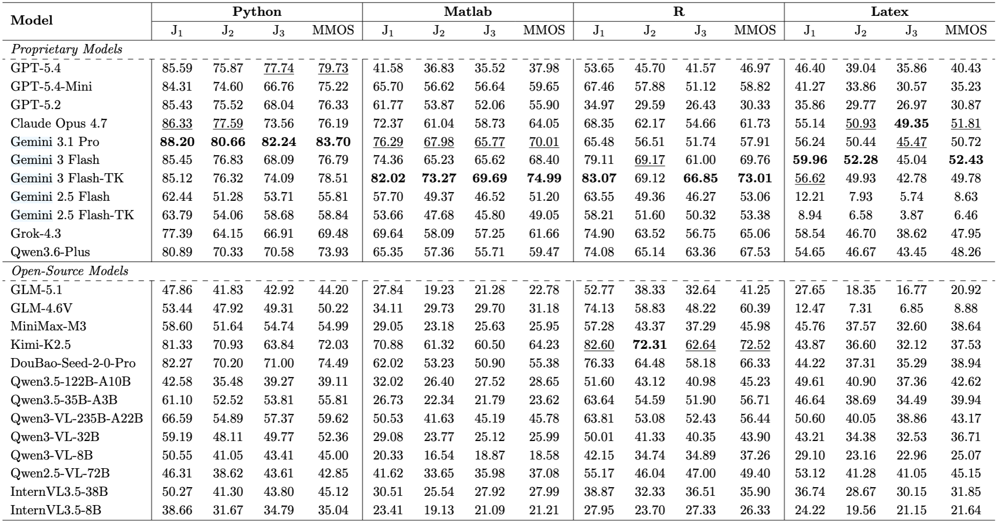
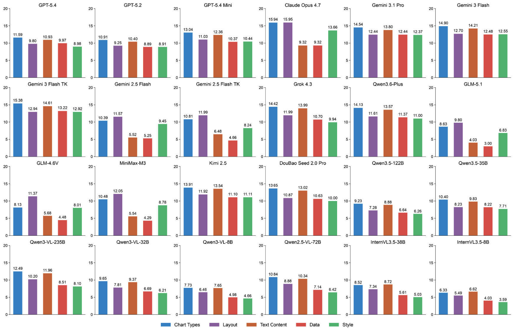
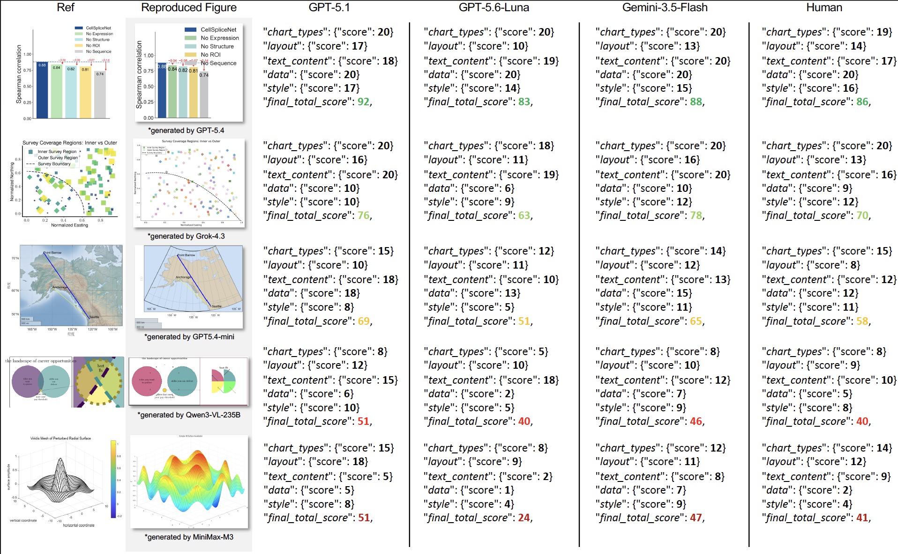

<div align="center">

<div>
<a href="https://github.com/zijianchen98/FigCodeBench"></a>
    <a href="https://github.com/zijianchen98/FigCodeBench"></a>
    <a href="https://arxiv.org/abs/2610.10066"></a>
    <a href="https://github.com/zijianchen98/FigCodeBench"></a>
    <a href="https://github.com/zijianchen98/FigCodeBench"></a>
</div>

<div style="width:20%; text-align:center; margin:auto;">
</div>
</div>

<h1>From Pixel to Coding: Evaluating the Figure Reproduction Capabilities of MLLMs</h1>

_Evaluating MLLMs on figure reproduction, integrating multimodal comprehension and generation._

<div>
    <a href="https://scholar.google.com.hk/citations?hl=zh-CN&user=NSR4UkMAAAAJ" target="_blank">Zijian Chen</a><sup>1,2</sup>,
    Zhengyu Chen<sup>1</sup>, Bohan Liang<sup>2</sup>, Lirong Deng<sup>3</sup>, Yushuo Zheng<sup>1,2</sup>, Yanwei Jiang<sup>1,2</sup>, Qi Jia<sup>2</sup>, Kaiwei Zhang<sup>2</sup>,Wenjun Zhang<sup>1</sup>,
    <a href="https://ee.sjtu.edu.cn/FacultyDetail.aspx?id=24&infoid=66&flag=66" target="_blank">Guangtao Zhai</a><sup>1,2,*</sup>
</div>

<div>
  <sup>1</sup>Shanghai Jiao Tong University, <sup>2</sup>Shanghai AI Laboratory, <sup>3</sup>Macao Polytechnic University
</div>   

<div>
<sup>*</sup>Corresponding author. 
</div>


<div style="width: 80%; text-align:center; margin:auto;">
</div>

</div>

> Abstract: Our benchmark offers (1) a comprehensive dataset and multi-dimensional evaluation pipeline; (2) an up-to-date leaderboard on MLLM figure reproduction proficiency; and (3) a nuanced understanding of the perceiving and reasoning bottlenecks hindering unified comprehension and generation in current MLLMs.


## News
- [2026/10/9] 🔥 The FigCodeBench dataset will be hosted and version-tracked on Hugging Face, and will be permanently accessible at [CCZZJJ/FigCodeBench](https://huggingface.co/datasets/CCZZJJ/FigCodeBench).
- [2026/10/8] 🔥 [Github repo](https://github.com/zijianchen98/FigCodeBench) for **FigCodeBench** is online.


## Introduction
Researchers often have a scientific figure and need working code that reproduces it. For a model, this means turning visual structure into a rendered program, not merely describing the image or answering questions about it. We argue that text-only coding tests and image-understanding tests leave this perception-to-generation step unmeasured. This project has proposed a novel evaluation benchmark, aiming to assess the model's ability to observe complex charts (such as line graphs, bar charts, scatter plots, architecture diagrams, etc.) and generate corresponding reproducing code. This not only tests the model's visual perception and fine-grained understanding, but also significantly challenges its logical reasoning and alignment ability in generating code.

### Core Contributions
1. 📈 **Comprehensive**：Containing 6,194 image-code pairs, covering four programming languages (Python, Matlab, R, and Latex). 
2. 🛠️ **Automatic**：Providing image-oriented, code-oriented metrics, _Mean Machine Opinion Score_, and _Figure-Code Fidelity_ metric.
3. 🏆 **24 MLLMs**：In-depth experiments were conducted on 24 mainstream MLLMs, revealing the capability boundaries of different models in the "figure-to-code" task, as well as their adaptability to different programming languages and common error patterns.


## 📊 Dataset & Metrics
* Huggingface: [Downloading link](https://huggingface.co/datasets/CCZZJJ/FigCodeBench/)


### Difficulty Distribution
<div style="width: 90%; text-align: center; margin:auto;">
      
</div>


### Language Collections

| Directory | Language | Source Code Extension |
|-----------|----------|-----------------------|
| `python/` | Python | `.py` |
| `Matlab/` | MATLAB | `.m` |
| `R/` | R | `.R` |
| `latex/` | LaTeX | `.tex` |

Figure images are stored in PNG format. Auxiliary information is provided in text files whose names end with `_auxinfo.txt`.

### Subsets and Versions

Each language directory contains two subsets:

- `exemplary/`
- `user_generated/`

Both subsets follow the same six-directory structure:

```text
<language>/
├── exemplary/
│   ├── code_base/
│   ├── code_variant1/
│   ├── code_variant2/
│   ├── image_base/
│   ├── image_variant1/
│   └── image_variant2/
└── user_generated/
    ├── code_base/
    ├── code_variant1/
    ├── code_variant2/
    ├── image_base/
    ├── image_variant1/
    └── image_variant2/
```

| Directory | Contents |
|-----------|----------|
| `code_base/` | Source code and auxiliary information for the base collection |
| `code_variant1/` | Source code and auxiliary information for the first variant collection |
| `code_variant2/` | Source code and auxiliary information for the second variant collection |
| `image_base/` | Figure images for the base collection |
| `image_variant1/` | Figure images for the first variant collection |
| `image_variant2/` | Figure images for the second variant collection |

The variant collections contain modified figure-code examples. Their sizes may differ from the base collection, so users should not assume that every base example has both variants.

### Visualization Categories

The Python, MATLAB, and R collections organize files into six visualization categories within each code and image directory:

```text
<code_or_image_directory>/
├── Composition/
├── Geospatial/
├── Mathematical/
├── Relational/
├── Statistical/
└── Temporal/
```

These categories cover composition-based visualizations, geographic plots, mathematical graphics, relationship-based charts, statistical graphics, and time-oriented visualizations.

The LaTeX collection (Conceptual) uses a flatter structure: source code, auxiliary information, and images are stored directly in their respective version directories, without the six category subdirectories.

--- 

### Environments
| Collection | Runtime / Toolchain | Main Libraries or Settings |
|------------|---------------------|----------------------------|
| Python | Python | Primarily `matplotlib` and `seaborn`; missing packages are automatically detected and installed during execution |
| MATLAB | MATLAB R2023a | Additional toolboxes may be required by individual scripts |
| R | R 4.6.0 | Missing R packages are automatically detected and installed during execution |
| LaTeX | A TeX distribution providing XeLaTeX | `xelatex` as the rendering engine; 300 DPI for rasterized output |

#### Python

The Python collection primarily uses **Matplotlib** and **Seaborn** for plotting. The execution workflow automatically detects missing packages in the local Python environment and installs them during execution, helping prevent figure-generation errors caused by missing dependencies.

```bash
pip install matplotlib seaborn
python FigCodeBench/figure_generation/generating_python.py
```

#### MATLAB

The MATLAB collection uses **MATLAB R2023a** as the reference local environment. Some examples may require additional MATLAB toolboxes.
```bash
python FigCodeBench/figure_generation/generating_matlab.py
```

#### R

The R collection uses **R 4.6.0** as the reference environment. The execution workflow automatically detects missing packages in the local R environment and installs them during execution, helping prevent figure-generation errors caused by missing dependencies.
```bash
python FigCodeBench/figure_generation/generating_R.py
```

#### LaTeX

The LaTeX collection uses **XeLaTeX** as the configured rendering engine. Install a TeX distribution that includes `xelatex`, together with the packages and fonts required by the examples.
```bash
pip install pdf2image
python FigCodeBench/figure_generation/generating_latex.py
```
`pdflatex` may be used for examples that are compatible with it, but it is not the reference engine. Examples that depend on XeLaTeX-specific font or Unicode features may not compile with `pdflatex`.


## Evaluated Models
We select **24** up to date and prevailing MLLMs for evaluation including **11** proprietary MLLMs and **13** open-source MLLMs. 
<div style="width: 50%; text-align: center; margin:auto;">
      
</div>


## FigCodeBench Leaderboard
_Left_: Mean Machine Opinion Score (MMOS) versus average cost per problem for various models. 
_Right_: Performance comparison of six representative models on different image categories.
<div style="width: 80%; text-align: center; margin:auto;">
      
</div>

<details close>
<summary>Evaluation cost (click to expand)</summary>

<div style="width: 100%; text-align: center; margin:auto;">
      
  </div>
</details>

<details close>
<summary>Results on image-oriented metrics (click to expand)</summary>

<div style="width: 100%; text-align: center; margin:auto;">
      
  </div>
</details>

<details close>
<summary>Results on code-oriented metrics (click to expand)</summary>

<div style="width: 70%; text-align: center; margin:auto;">
      
  </div>
</details>

<details close>
<summary>Results on Mean Machine Opinion Score (MMOS) (click to expand)</summary>

<div style="width: 100%; text-align: center; margin:auto;">
      
</div>

- Detailed MMOS distribution
<div style="width: 100%; text-align: center; margin:auto;">
      
</div>

- Qualitative results
<div style="width: 100%; text-align: center; margin:auto;">
      
</div>
</details>

<details close>
<summary>Results on Figure-Code Fiedlity (FCF) (click to expand)</summary>

<div style="width: 70%; text-align: center; margin:auto;">
      
  </div>
</details>


---


## Contact

Please contact the first author of this paper for queries.

- Zijian Chen, `zijian.chen@sjtu.edu.cn`

## Citation
Please feel free to cite our paper:
```
@misc{chen2026pixelcodingevaluatingfigure,
      title={From Pixel to Coding: Evaluating the Figure Reproduction Capabilities of MLLMs}, 
      author={Zijian Chen and Zhengyu Chen and Bohan Liang and Lirong Deng and Yushuo Zheng and Yanwei Jiang and Qi Jia and Kaiwei Zhang and Wenjun Zhang and Guangtao Zhai},
      year={2026},
      eprint={2610.10066},
      archivePrefix={arXiv},
      primaryClass={cs.CV},
      url={https://arxiv.org/abs/2610.10066}, 
}
```

